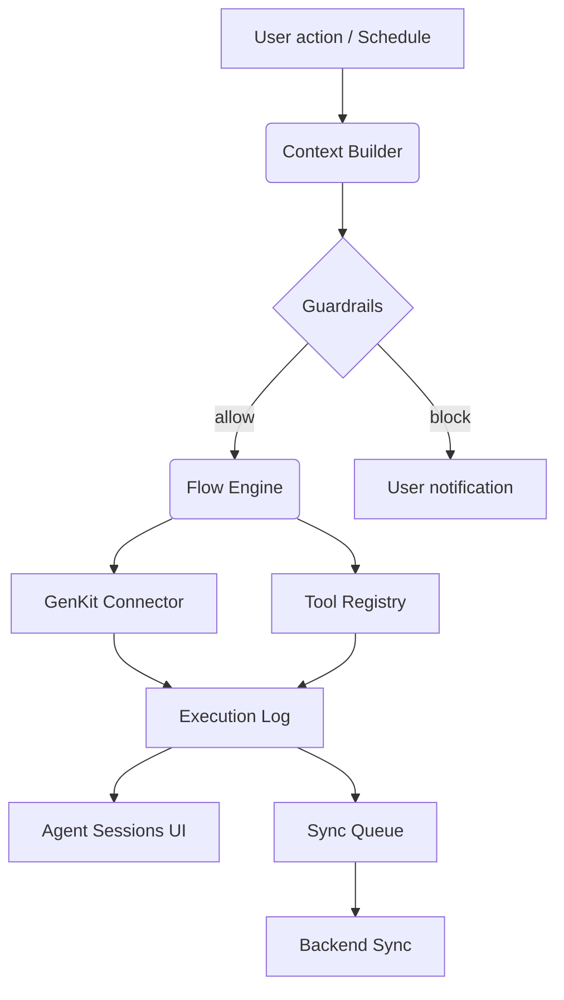

# Каталог и операционная модель ИИ-агентов QuickEstimate Builder

## 1. Роли агентов
| Категория | Назначение | Примерные сценарии | Ключевые метрики |
| --- | --- | --- | --- |
| **Price Refreshers** | Обновляют цены материалов и работ из внешних источников. | «Актуализировать прайс по поставщику X», «Синхронизировать с каталогом CSV». | Доля успешно обновлённых позиций, средняя экономия времени, стоимость запроса. |
| **Margin Analysts** | Анализируют маржинальность, выявляют риски перерасхода, предлагают оптимизации. | «Найти позиции с просроченными расценками», «Рассчитать маржу по группам». | Время ответа, количество actionable рекомендаций, оценка пользователя. |
| **Scope Auditors** | Проверяют структуру сметы на полноту, дубли и соответствие нормам. | «Проверить соответствие сметы СНиП», «Найти возможные дубли позиций». | Процент обнаруженных проблем, false positives. |
| **Reporters** | Готовят структурированные отчёты (PDF/Markdown/JSON) на основе сметы и логов. | «Сформировать summary для клиента», «Сгенерировать XLSX для бухгалтерии». | Латентность генерации, качество форматирования, повторная пригодность отчёта. |
| **Custom Agents** | Сценарии, собранные пользователем или интегратором. | «Собрать коммерческое предложение», «Сопоставить с гос. реестром». | Кол-во запусков, ошибки валидации, потребление токенов. |

## 2. Жизненный цикл конфигурации
1. **Создание**: пользователь запускает мастер (см. §5), выбирает категорию, вводит цель, данные и ограничения.
2. **Проверка**: FlowEngine валидирует схему, подсвечивает отсутствующие шаги, пересчитывает прогнозируемую стоимость токенов.
3. **Публикация**: `AgentRegistry` присваивает версию, сохраняет в IndexedDB (`agents` + `agentRevisions`), синхронизирует с сервером.
4. **Эксплуатация**: агент доступен из галереи и quick actions. Поддерживаются плановые и ручные запуски, работа офлайн (ограниченная).
5. **Модернизация**: через версионный мастер пользователь обновляет конфигурацию, видит diff между версиями, может откатиться.
6. **Архивация/удаление**: доступна мягкая архивация (снятие с публикации), хранение логов до истечения политики ретенции.

## 3. Структура данных (дополнение к `docs/ai-module.md`)
```ts
// Новая таблица для версионности
interface AgentRevision {
  id: string;
  agentId: string;
  version: number;
  summary: string;
  changeLog: string;
  authorId: string;
  createdAt: string;
}

interface AgentExecutionMetric {
  sessionId: string;
  agentId: string;
  totalTokens: number;
  completionTokens: number;
  promptTokens: number;
  costUsd: number;
  durationMs: number;
  success: boolean;
  createdAt: string;
}

interface AgentSchedule {
  id: string;
  agentId: string;
  cron: string; // формат Quartz-like
  timezone: string;
  enabled: boolean;
  lastTriggeredAt?: string;
}
```
- В хранилище `agentSessions` добавляем поля `trigger` (`manual` | `schedule` | `webhook`), `runEnvironment` (`device` | `cloud`).
- В `AgentConfig` (см. `docs/ai-module.md`) добавляем `tags: string[]` для фильтрации и `guardrails: GuardrailRule[]`.

## 4. Потоки данных агента

- **Guardrails**: набор правил (лимит стоимости, требование подтверждения перед отправкой PII, whitelists источников).
- **Execution Log**: хранит пошаговые записи (timestamp, шаг, вывод, ошибка). Поддерживает экспорт и фильтрацию по тегам агента.
- **Sync Queue**: при офлайн-запусках сохраняет результаты и логи для дальнейшей отправки.

## 5. UX-потоки
### 5.1 Мастер создания агента
1. **Goal**: выбрать тип, задать название, бизнес-цель (авто-генерация описания).
2. **Data & Permissions**: выбрать доступные каталоги, сметы, установить guardrails.
3. **Flow**: конструирование шагов drag-n-drop, проверка совместимости (подсказки).
4. **Prompt & Tuning**: редактор prompt-блоков с подсветкой переменных и предпросмотром.
5. **Review & Test**: запуск в песочнице на тестовой смете, вывод метрик и стоимости.
6. **Publish**: выбор тэгов, расписания, уведомлений, подтверждение.

### 5.2 Просмотр галереи
- Карточки агента: статус (Active/Draft/Archived), последнее выполнение, средняя стоимость, CTA «Запустить», «Настроить».
- Фильтры: категории, теги, авторы, диапазон стоимости, наличие расписания.
- Быстрые действия: свайп влево → «Запланировать», свайп вправо → «Скопировать». Поддержка haptic feedback (iOS).

### 5.3 Панель сессии
- Таймлайн шагов с индикаторами успех/ошибка.
- Возможность разворачивать каждый шаг → видеть промпт (с маскированием конфиденциальных данных), ответ, токены.
- Кнопки «Повторить», «Создать задачу» (прикрепление рекомендаций к смете), «Экспорт лога».
- Раздел «Insights»: агрегированные метрики, сравнение с прошлым запуском.

## 6. Автоматизация и интеграции
- **Schedules**: Cron-like правила, хранение в IndexedDB, синхронизация с сервером для облачных запусков.
- **Webhooks/Triggers**: REST-hook (`POST /agents/{id}/trigger`) и локальные события (`estimate.updated`).
- **Tool Plugins**: соглашение `registerTool({ id, name, inputSchema, outputSchema, permissions, handler })`.
- **Security Layer**: перед запуском агент проверяет наличие скоупов, подписывает payload HMAC при отправке на сервер.
- **Budget Manager**: лимиты на стоимость/количество запусков. При превышении — уведомление и блокировка.

## 7. Наблюдаемость и комплаенс
- Панель метрик (Grafana/PostHog) с показателями токенов, успехов, ошибок, времени ответа.
- Автоматический redaction PII в логах, хеширование идентификаторов проектов.
- Журнал админских действий (создание/удаление агента, изменение guardrails).
- Подготовка отчётов для аудита: экспорт конфигураций и логов в зашифрованном виде.

## 8. План эволюции
- **v0.1**: ручные запуски, мастер, два встроенных агента, логирование токенов, экспорт JSON.
- **v0.2**: расписания, guardrails, кастомные плагины инструментов, multi-step UI.
- **v0.3**: совместное редактирование агента, комментирование, marketplace конфигураций.
- **v1.0**: облачные агенты с распределёнными воркерами, marketplace, адаптивные guardrails с ML.
