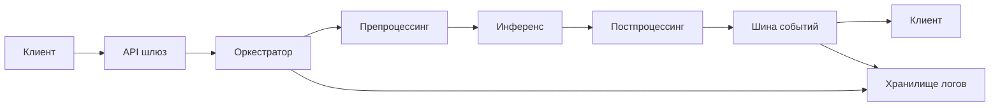

# AI-модуль

## Последовательность выполнения флоу
1. **Инициация запроса** — внешний клиент формирует запрос в API шлюз и передает минимальный контекст (идентификатор пользователя, тип задачи, параметры).
2. **Валидация и нормализация** — шлюз проверяет схему, нормализует данные и добавляет системные метаданные (источник, версия протокола).
3. **Оркестрация пайплайна** — оркестратор создает `trace_id`, резервирует вычислительные ресурсы и определяет ветки обработки (препроцессинг, инференс, постпроцессинг).
4. **Препроцессинг** — сервис подготовки данных очищает, агрегирует и шифрует чувствительные поля, формируя пакет для модели.
5. **Инференс** — AI-сервис выполняет модель, генерирует результат и побочные метрики (скор, confidence, пояснения).
6. **Постпроцессинг и бизнес-правила** — модуль бизнес-логики валидирует результат, применяет правила и обогащает контекст.
7. **Доставка ответа** — ответ и артефакты (метрики, диагностические данные) возвращаются в шлюз, который отправляет их клиенту и публикует события в шину.



## Архитектура логирования
### Формат записи
| Поле            | Тип              | Описание                                         |
|-----------------|------------------|--------------------------------------------------|
| `timestamp`     | ISO 8601         | Время события в UTC                              |
| `level`         | Enum             | Уровень (TRACE, DEBUG, INFO, WARN, ERROR)        |
| `message`       | String           | Человекочитаемое описание                        |
| `trace_id`      | UUID             | Общий идентификатор запроса                      |
| `span_id`       | UUID             | Идентификатор конкретной операции                |
| `parent_span`   | UUID/null        | Ссылка на родительский span                      |
| `service`       | String           | Имя сервиса/модуля                               |
| `event_type`    | String           | Категория события (ingress, inference, etc.)     |
| `payload`       | JSON             | Структурированные данные события                 |
| `tags`          | Map<String,String>| Пользовательские метки для фильтрации           |

### Ключи контекста
- **Корреляция пользователя**: `user_id`, `session_id`, `account_id`.
- **Исполнение модели**: `model_id`, `model_version`, `latency_ms`, `confidence`.
- **Инфраструктура**: `region`, `node_id`, `environment`.
- **Диагностика**: `error_code`, `retry_count`, `resource_usage.cpu`, `resource_usage.memory`.

### Хранилище и поток данных
| Уровень           | Компонент            | Назначение                                | Временное окно |
|-------------------|----------------------|-------------------------------------------|----------------|
| Буфер             | Kafka / Pulsar       | Прием и временное хранение логов          | < 1 час        |
| Горячее хранилище | ClickHouse / OpenSearch | Оперативная аналитика и дешифрация        | 14 дней        |
| Холодное хранилище| S3/Blob Storage + Iceberg | Долгосрочная ретенция и батч-аналитика | 13 месяцев     |

```mermaid
flowchart TB
    Ingest[Сервисы AI] --> Queue[Стриминговая шина]
    Queue --> Hot[Горячее аналитическое хранилище]
    Queue --> StreamProc[Стриминговый ETL]
    StreamProc --> Cold[Объектное хранилище (Iceberg/S3)]
    Hot --> BI[BI/Дашборды]
    Cold --> ML[ML/Аудит]
```

## Корреляция, ретенция и архивация
- **Trace/Span нотация**: каждое обращение генерирует `trace_id`; вложенные операции фиксируются как `span_id` с `parent_span`. Для внешних интеграций поддерживаются `baggage`-атрибуты (например, `x-trace-flags`) для передачи контекста между системами.
- **Корреляция событий**: объединение выполняется по `(trace_id, span_id)` и дополнительным ключам `user_id`, `model_id`. Для долгих операций используется `span_kind` (`client`, `server`, `producer`, `consumer`) и `status` (`ok`, `error`).
- **Ретенция**: в горячем хранилище хранить максимум 14 дней с автоматическим TTL. Критичные бизнес-события помечаются тегом `retention=extended` и реплицируются в холодное хранилище с политикой 13 месяцев.
- **Архивация**: ежемесячные снепшоты холодного хранилища архивируются в Glacier/Coldline с шифрованием и версионированием. Индексы и схемы сохраняются отдельно в репозитории конфигураций. Доступ к архивам осуществляется через заявки с многофакторной аутентификацией.
